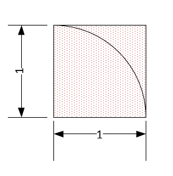

# ECE 695 CUDA Programming Part 1 <br><br> Professor Tim Rogers


## Introduction

The purpose of this lab is to familiarize yourself with CUDA programming and the fundamental methodology for parallelizing a traditional CPU-based algorithm for GPU acceleration.  

The official [CUDA Documentation](https://docs.nvidia.com/cuda/) is the best resource for  implementation details and API specifics. You will find yourself referring back to various sections of this page over the next few weeks as we delve deeper into the CUDA API and the architecture of a GP-GPU. 

-----------------------------------------------------------
<br>

## PART A: Single-precision A · X Plus Y (SAXPY)

SAXPY stands for `Single-Precision A·X Plus Y`.  It is a function in the standard [Basic Linear Algebra Subroutines (BLAS)](http://en.wikipedia.org/wiki/Basic_Linear_Algebra_Subprograms) library. SAXPY is a combination of scalar multiplication and vector addition, and it’s very simple: it takes as input two vectors of 32-bit floats X and Y with N elements each, and a scalar value A. It multiplies each element `X[i]` by `A` (Scale) and adds the result to `Y[i]`.


### CPU Implementation

An simple CPU-based implementation for `saxpy` can be found in `saxpy_cpu.c` in your Lab1 starter code. One major difference from *ideal* saxpy routines is that the function writes the results of each multiply-accumulate operation into a new vector `z` instead of overwriting the existing vector `y`. This is both in the interest of simplicity and easily checking your code for correction.


```C++
void saxpy_cpu(float* x, float* y, float* z, float scale, size_t size) {
    for (int idx = 0; idx < size; ++idx) {
        z[idx] = scale * x[idx] + y[idx];
    }
}
```
### GPU Implementation

SAXPY is an embarrassing parallel workload where the computation of each element in the vector is completely independent of all other elements. To parallelize SAXPY for the GPU, we will use the x dimension (recall thread organization from the lectures) such that each thread will (execute the saxpy computation to) generate a single member of the output vector. 


### Required Background

A understanding of the following functions will be crucial to proper execution of this portion of the assignment.

```C++
cudaMalloc()
cudaMemcpy()
cudaFree()
```
Furthermore, the elements of each vector can be generated using the `rand()` function. However, you might find it easier to test/debug your code with a simpler pattern of your choice.

#### TODO: Outline
- explain premise
- explain CPU code
- explain parallelization scheme for GPU
- mention expected input - output format
- 

-----------------------------------------------------------
<br>

## PART B: Monte Carlo estimation of the value of _&pi;_

Monte Carlo methods are a broad class of computational algorithms that rely on repeated random sampling to obtain numerical results. [[1]](#1)
Among a wide variety of applications, this method can be utilized to estimate the value of _&pi;_ as described below.

<span style="display:block;text-align:center">\
    
</span>


### Estimating _&pi;_

We will be exploiting the relation between the area of a unit square and the quarter of a unit circle. 

- Area of a quarter circle  = _&pi; r <sup>2</sup> / 4_     = _&pi; / 4_
- Area of a unit square     = s <sup>2</sup>                = 1

We can generate random points all over the area of a unit square and calculate the probability of any such point lying within the unit circle (distance from origin < 1). With a large enough set of points, we will be able to somewhat accurately estimate the value of _&pi;_ to a few decimal points.

### CPU Implementation

### Generating random points

- C/C++ rand() function
    -   optional STL random

The standard C/C++ `rand()` function [[2]](https://en.cppreference.com/w/c/numeric/random/rand) [[3]](https://en.cppreference.com/w/cpp/numeric/random/rand) can be used to generate random integral values between `0` and `RAND_MAX`. 

For simplicity, we will treat both the x and y coordinates of a point as independent uniform random variables

#### TODO: Outline
- describe monte-carlo pi
- explain CPU code
- explain parallelization scheme
    - add reduction optimization
- mention expected input-output format


### OPTIONAL: MAP-Reduce 
## References
<a id="1">[1]</a> 
[Wikipedia - Monte-Carlo Method](https://en.wikipedia.org/wiki/Monte_Carlo_method)

<a id="cppref">[2]</a>
[cppreference](https://en.cppreference.com)
